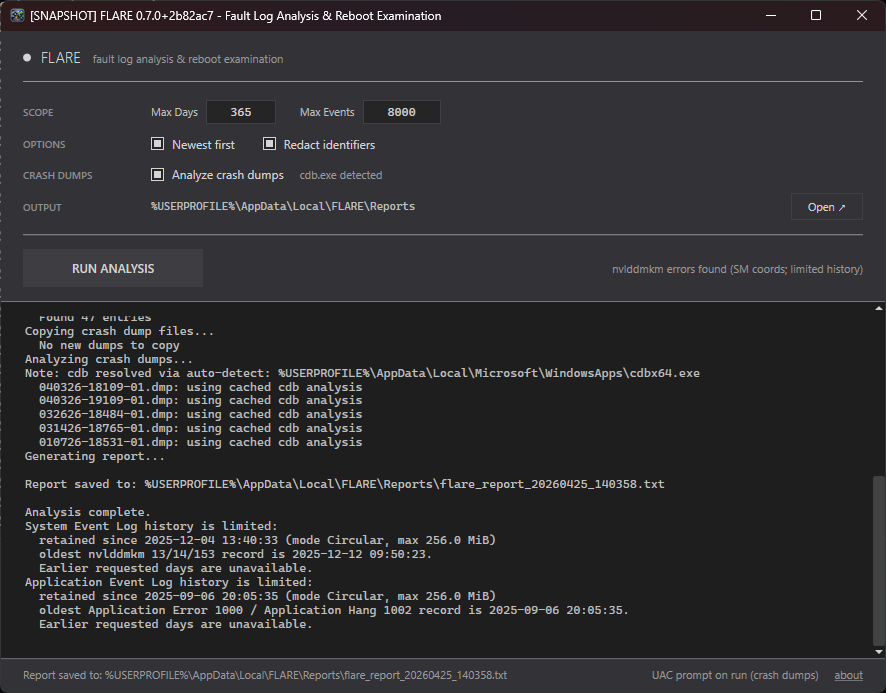

# FLARE - Fault Log Analysis & Reboot Examination


A Windows tool for NVIDIA GPU diagnostics. Collects data from Windows Event Log (`nvlddmkm` driver errors), kernel crash dumps, and nvidia-smi, then correlates it into a comprehensive diagnostic report.



## What it does

FLARE gathers and correlates data from multiple sources:

1. **GPU identification** via nvidia-smi (name, driver, UUID) and Vulkan (SM count query using `VkPhysicalDeviceShaderSMBuiltinsPropertiesNV` — the only reliable method on consumer GPUs). Includes current vs max PCIe link gen/width at sample time, with an idle-power caveat when the sampled link is below its capability.
2. **System identification** — motherboard make/model, BIOS vendor/version/date, CPU, and total RAM, read from the registry's SMBIOS snapshot + `GlobalMemoryStatusEx`. Useful context for troubleshooting upstream causes (outdated BIOS with known NVIDIA quirks, misnegotiated PCIe link), not a conclusion on its own.
3. **NVIDIA driver errors** from Windows Event Log (`nvlddmkm` events):
   - Event ID 13 — SM errors with GPC/TPC/SM coordinates and error types (Illegal Instruction Encoding, Misaligned PC, etc.)
   - Event ID 14 — PCIe/ECC errors (SRAM uncorrectable, command re-execution)
   - Event ID 153 — TDR (Timeout Detection and Recovery)
4. **System crash events** — BSODs (WER ID 1001) and unexpected reboots (Kernel-Power ID 41)
5. **Application crash correlation** — pulls application crashes (Event ID 1000) and hangs (Event ID 1002) from the Application log, then correlates them by timestamp with GPU errors to identify which applications were affected
6. **Kernel minidump analysis** — parses PAGEDU64/MDMP crash dumps to extract bugcheck codes and parameters, identifies GPU-related crashes (VIDEO_TDR_FAILURE, VIDEO_TDR_TIMEOUT_DETECTED, VIDEO_SCHEDULER_INTERNAL_ERROR)
7. **Driver install history** — reads Kernel-PnP, DeviceSetupManager, and `setupapi.dev.log` to reconstruct the driver install timeline, annotated onto the error frequency chart so you can see whether a driver change coincided with an error surge
8. **Report generation** — error summary with SM coordinate concentration analysis, weekly error frequency chart with driver annotations, full error timeline, application crash correlation, crash events

## Requirements

- Windows 10/11
- [.NET 10 Desktop Runtime](https://dotnet.microsoft.com/download/dotnet/10.0) (or SDK for building from source)
- NVIDIA GPU with drivers installed (for nvidia-smi)
- No elevation needed up front. FLARE runs unelevated and prompts for UAC only when crash dump analysis is enabled and system minidumps need to be copied; that brief helper step is the only code that runs as administrator. All other collection and cdb analysis runs unelevated.

## Download

Grab the latest build from the [GitHub Releases page](../../releases). Single `FLARE.exe`, no installer. Requires the [.NET 10 Desktop Runtime](https://dotnet.microsoft.com/download/dotnet/10.0). Per-commit CI builds are also available from [GitHub Actions artifacts](../../actions), but those expire after 90 days — use Releases for anything you want to keep.

The title bar tells you which kind of build you're running: a clean `FLARE 0.7.0 - …` is a tagged release; `[SNAPSHOT] FLARE 0.7.0+<hash> - …` is a per-commit CI artifact; `[DEV BUILD] FLARE 0.7.0+dev - …` is a local `dotnet build`. The About dialog repeats this information.

**Unsigned binary — and it's going to stay that way.** FLARE releases are not code-signed and will not be. Windows SmartScreen may warn on first run. This is a permanent, deliberate project decision; please don't file issues or review comments asking for it to change.

Why it's settled:

- FLARE is a single-maintainer, zero-revenue diagnostic utility. Authenticode code-signing certificates (especially EV, which is what actually bypasses SmartScreen reputation gating) are an ongoing paid subscription plus HSM/token logistics. That cost-and-ops overhead is not proportionate to a hobby tool.
- A signature on the binary proves only that someone bought a cert under some name. It does not prove the code does what the README says, and it does not prove the build wasn't tampered with upstream. The trust problem a signature *appears* to solve is not actually the trust problem users have here.
- FLARE's actual provenance story is different and, for this project's threat model, stronger: every line of source is in this repo, every release is built by GitHub Actions from a tagged commit using SHA-pinned workflow actions, and the release artifact is accompanied by a `SHA256SUMS.txt`. If you want to verify a binary, rebuild it — the CI workflow is a dozen steps you can run locally. If you don't trust a cert-issuance authority but *do* trust reading source, that path is open to you and it is not open with most signed software.
- If the project's ownership, funding model, or distribution story ever changes in a way that makes signing proportionate, this note will be updated alongside that change. Until then, "please sign the binary" is not an actionable request.

If the above doesn't meet your personal trust bar, the supported answers are: (1) build from source using the `dotnet build` instructions below; (2) don't run FLARE. Both are fine.

For users who do choose to run the release binary:

- Download FLARE only from the [official GitHub Releases page](../../releases) — not from mirrors, third-party sites, or file attachments elsewhere.
- When a `SHA256SUMS.txt` file is published alongside the zip, verify the zip's hash before running:
  ```
  Get-FileHash -Algorithm SHA256 FLARE-<version>-win-x64.zip
  ```
  and compare against the value in `SHA256SUMS.txt`.

## Building from source

```
dotnet build FLARE.slnx
dotnet test FLARE.slnx
```

## Project structure

```
FLARE/
├── FLARE.Core/          # Shared logic (GPU info, event log parsing, dump analysis, report generation)
├── FLARE.UI/            # WPF desktop application
├── FLARE.Tests/         # xUnit tests
├── FLARE.slnx
└── .github/workflows/   # CI build pipeline
```

## Crash dump analysis with cdb.exe

FLARE can optionally use **cdb.exe** for detailed crash dump analysis. cdb is the command-line debugger from the Windows Debugger (WinDbg) package — same analysis engine as the full GUI, but scriptable. FLARE runs `!analyze -v` on each dump to extract:

- Faulting module and driver name
- Stack traces showing the crash path
- Bugcheck classification strings
- Process context at the time of crash

The crash dump analysis checkbox copies system minidumps and runs FLARE's built-in dump parser. If cdb.exe is detected, FLARE also runs `!analyze -v` on those dumps; when the checkbox is off, FLARE does not copy or analyze minidumps. FLARE itself stays unelevated; only the crash-dump copy helper prompts for elevation when needed. cdb.exe is run by the unelevated parent process when available.

FLARE auto-detects cdb.exe under Microsoft debugger locations — Windows Kits (`Program Files\Windows Kits\10\Debuggers`), WinDbg app packages (`Program Files\WindowsApps\*WinDbg*`), and per-user WinDbg aliases under `LocalAppData\Microsoft\{WindowsApps,WinDbg}`. PATH is intentionally not used, and there is no configured cdb path override.

**Note:** cdb deep analysis takes up to 30 seconds per dump file. With many dumps in `C:\WINDOWS\Minidump`, the first analysis run over a fresh set can run to several minutes. Results are cached under `%LOCALAPPDATA%\FLARE\DO_NOT_SHARE\CdbCache`, keyed on the dump's path, size, and mtime, so subsequent runs reuse the prior transcript and only newly-copied dumps incur the cost. Delete that cache folder to force re-analysis. The analysis can be cancelled at any time via the Cancel button.

### Installing cdb.exe

```
winget install Microsoft.WinDbg
```

Alternatively, install the [Windows SDK](https://developer.microsoft.com/en-us/windows/downloads/windows-sdk/) and select "Debugging Tools for Windows" during setup.

## Output

Reports are saved to `%LOCALAPPDATA%\FLARE\Reports\`. The **Open** button in the UI jumps there in Explorer and, after a run, highlights the saved report. The report folder contains only the generated `.txt` — no dumps, no caches — so it's safe to zip, share, or sync as-is. If you want a specific report somewhere else, copy the `.txt` after the run.

Upgrading from 0.6.x? On first launch, FLARE auto-migrates `%LOCALAPPDATA%\FLARE\CdbCache\` and the default `%LOCALAPPDATA%\FLARE\Reports\minidumps\` into the new `DO_NOT_SHARE\` layout. If you had pointed 0.6.x at a custom report folder, your old `<custom>\minidumps\` stays there — move its contents into `%LOCALAPPDATA%\FLARE\DO_NOT_SHARE\Minidumps\` yourself (or delete it).

When crash dump analysis is enabled, dumps are copied from the system minidump directory (`HKLM\SYSTEM\CurrentControlSet\Control\CrashControl\MinidumpDir`, or `%SystemRoot%\Minidump` if unset) into `%LOCALAPPDATA%\FLARE\DO_NOT_SHARE\Minidumps\`, outside the report folder. The cdb `!analyze -v` transcript cache lives alongside it under `%LOCALAPPDATA%\FLARE\DO_NOT_SHARE\CdbCache\`. The folder is named for what it is: raw kernel-memory fragments and stack traces with local paths that aren't meant to travel with the report.

### Redaction

Redirected user folders are handled through the actual environment roots too: paths rooted at `%APPDATA%`, `%LOCALAPPDATA%`, `%TEMP%`, `%TMP%`, or OneDrive environment variables are rewritten to those markers instead of leaking the concrete directory.

**Redact identifiers** is on by default, so the saved `.txt` report can be pasted into a forum thread or support ticket without first scrubbing it by hand. Redaction replaces the GPU UUID and the computer name with `[redacted]` and rewrites Windows user-profile paths to `%USERPROFILE%` in cdb stack traces. Process names, driver/module names, and stack frames are always preserved — without them the report has no diagnostic value.

When redaction is enabled, every user-visible string FLARE writes goes through the same scrubbing — the visible run log, the bottom status bar, the OUTPUT path row and tooltip, the cdb status tooltip, and the unhandled-exception popup. Toggling redaction live re-renders the persistent surfaces (OUTPUT path, cdb tooltip); status-bar messages already shown stay as written, the next status update reflects the new setting. Raw cdb transcripts cached under `DO_NOT_SHARE\CdbCache\` are not redacted; they stay local and redaction runs when report text is rendered.

Uncheck the option only when a troubleshooting conversation needs the GPU UUID in the report text itself.

## How it works (technical details)

- Event log data is read via the `System.Diagnostics.Eventing.Reader` API with XPath filters, because the `nvlddmkm` event Message field is always empty on these events — the actual error data lives in the `EventRecord.Properties` collection (`EventData/Data` XML nodes)
- nvidia-smi cannot report SM count on consumer GPUs — the Vulkan `VK_NV_shader_sm_builtins` extension is queried instead, iterating physical devices to skip integrated GPUs
- Consumer GPUs report serial number as "0", so UUID is used for identification
- Crash dumps carry one of three signatures: PAGEDU64/PAGEDUMP (kernel-mode), MDMP (user-mode), or PAGE (32-bit kernel). Kernel-mode 64-bit dumps carry the bugcheck code at offset 0x38

## Disclaimer

This tool is provided as-is with no warranty. It reads system logs and crash dumps — it does not modify any system files, drivers, or settings.

## License

[GPL v3](LICENSE)
